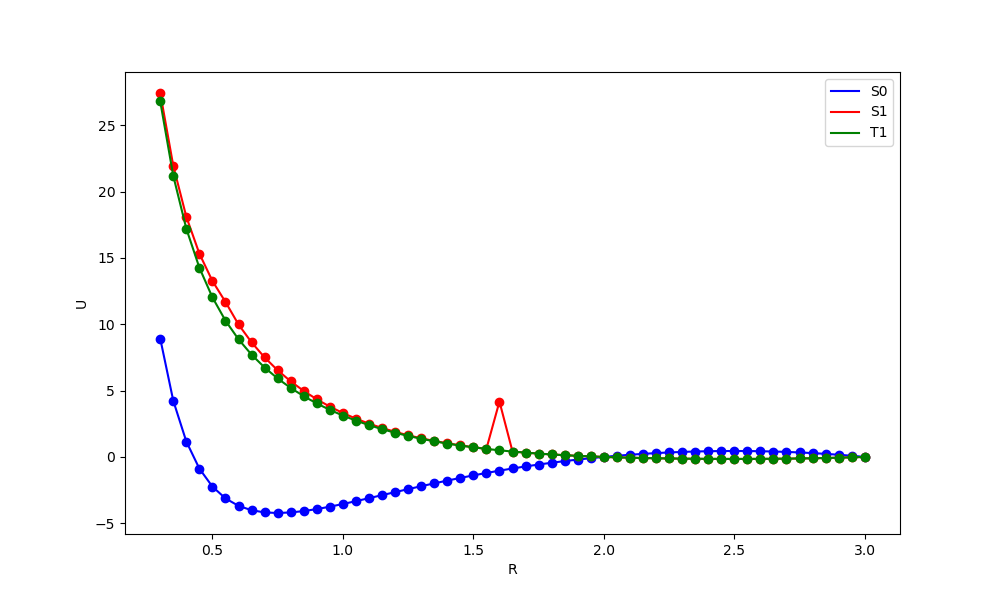

## Задание по CP2K и ROKS

### 1) Собрать CP2K
Собрал

### 2) Запустить пример водорода. Понять его. 
Запустил. Понял

### 3) Сравнить силы между одинаковыми конфигурациями в CP2K(s0) и VASP(малая SIGMA)
Расчеты приведены в папке ```forces``` для молекулы H2 с расстоянием 1.0 Ang между ионами.
Силы в CP2K:
```
ATOMIC FORCES in [a.u.]

 # Atom   Kind   Element          X              Y              Z
      1      1      H           0.08169063     0.00000000     0.00000000
      2      1      H          -0.08169074     0.00000000     0.00000000
```
Силы в VASP:
```
POSITION                                       TOTAL-FORCE (eV/Angst)
 -----------------------------------------------------------------------------------
      0.00000      0.00000      0.00000         4.153126      0.000000      0.000000
      1.00000      0.00000      0.00000        -4.153126      0.000000 
```

Переводя атомные единицы в ev/A:
$$
0.08169063 \text{ a.u} \times 51.421 = 4,200613885 \text{ eV/\AA}\approx 4.153126\text{ eV/\AA}
$$
Различие между силами можно связать с различием используемых функционалов.

### 4) Построить термы H-H (Для S0, S1, T1)
Расчеты зависимостей U(R) приведены в папках ```S0```, ```S1```, ```T1```.

Для получения состояний S1 и Т1 используется метод ROKS.
T1 является простым триплетом, поэтому для его получения просто выставим ```MULTIPLICITY 3```, а коэффициенты для энергии в методе ROKS оставим нулевыми.

Для получение синглета S1 воспользуется формулой:
$$
E(S1) = 2E(Mixed) - E(T)  = E(T)(already\ calculated)  + 2E(Mixed) - 2 E(T) 
$$
Соответственно, выставим параметры ROKS:
```
ENERGY_SCALING 2.0 -2.0
SPIN_CONFIGURATION 1  2
SPIN_CONFIGURATION 1  1
```
Полученные результаты представлены на графике ```graph.png```, полученным при помощи ```graph.py```
