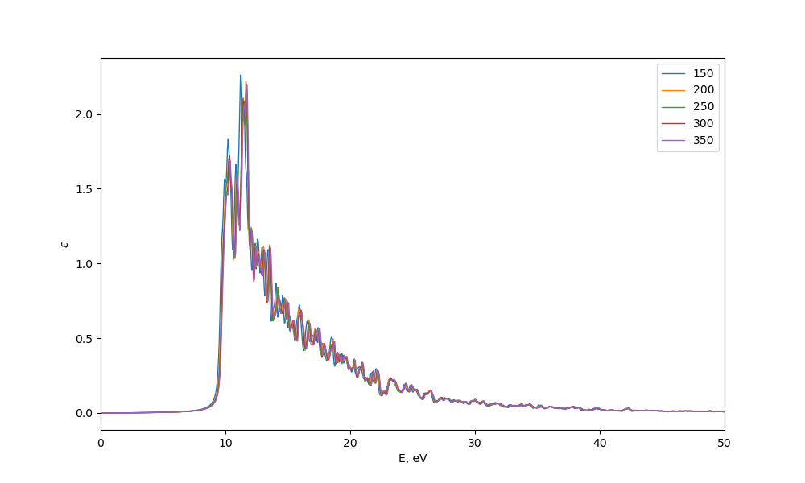
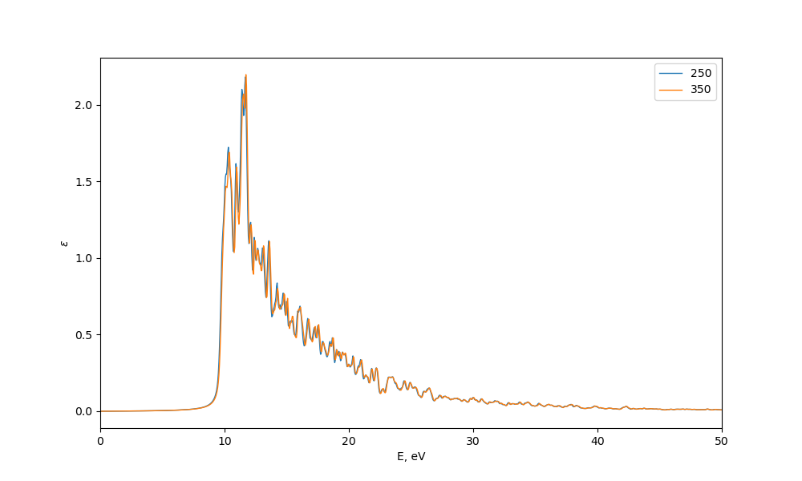
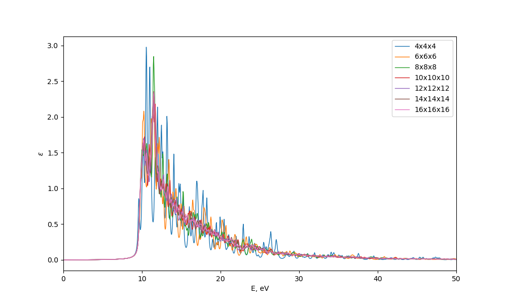
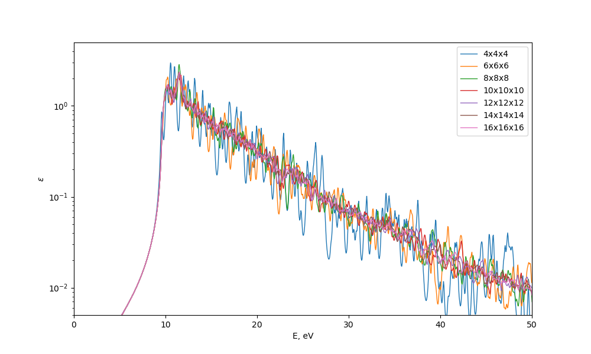
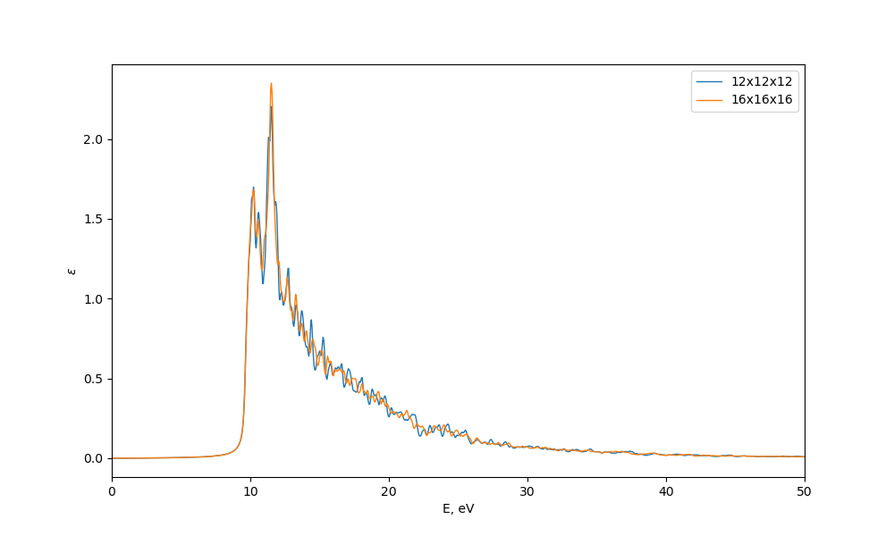
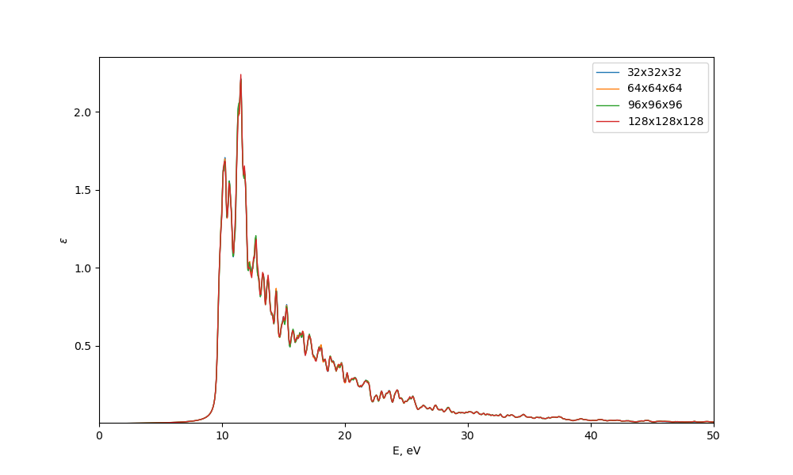

## Расчет оптических свойств DFT.

Расчет выполнен для структуры кристаллического водорода [mp-632291](https://materialsproject.org/materials/mp-632291)

### 1. Сходимость мнимой ДП по базису плоских волн (параметр ENCUT)

Зафиксируем ```KPOINTS=10x10x10```, ```NBANDS=64``` и рассмотрим сходимость по параметру ```ENCUT```.

Расчет приведен в папке ```encut```, входные файлы в папке ```encut/template```. Для получение мнимой ДП сначала производим обычный DFT расчет (```INCAR.DFT```), затем пользуясь полученным базисом волн, считаем мнимую диэлектрическую проницаемость без локальных эффектов (```INCAR.nolocal```).

Полученные результаты:


Cходимость достигается на ```ENCUT=250```


На самом деле, можно было использовать и 200, в параметрах потенциала указано ```ENCUTmin=200```, ```ENCUTmax=250```.

### 2. Сходимость мнимой ДП по числу k-точек в зоне Бриллюэна.

Зафиксируем ```ENCUT=250```, ```NBANDS=64``` и рассмотрим сходимость по параметру ```KPOINTS```.

Расчет приведен в папке ```kpoints```, входные файлы в папке ```encut/template```. Процедура расчета аналогична 1.

Полученные результаты:



Cходимость достигается на ```KPOINTS=12x12x12```


При этом отметим, что на 10 kpoints наблюдается расщепление пика, то есть уменьшить число kpoints нельзя.

### Сходимость мнимой ДП по числу орбиталей (NBANDS)

Проделаем то же самое, перебирая число орбиталей.



Видно, что особо различий нет, повезло. Возьмем 32.

### 4. Проверить правило сумм.

Проведем расчет для выбранных чисел в папке ```nolocal```.

```math
\int_0^{\infty} \omega \epsilon d\omega = \frac{\pi}{2}\omega_p^2
```

Расчитывая это для выбранного вещества, получаем
```math
175.59614926122285 \text{ eV}^2 \approx 181.42880611217063 \text { eV}^2
```
Правило выполняется с достаточно хорошей точностью.